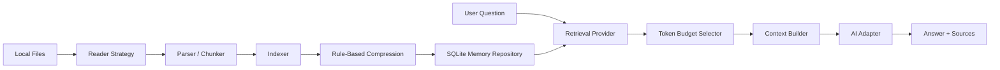
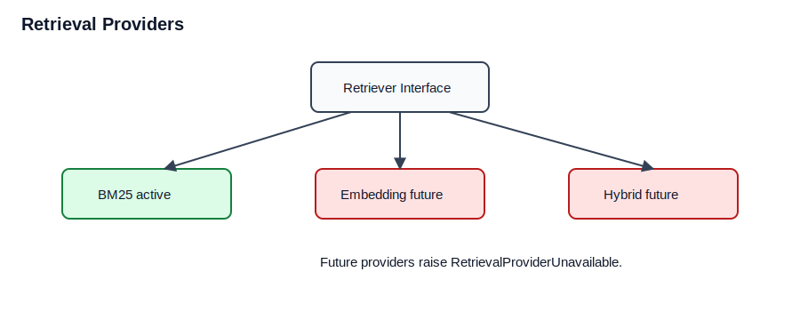
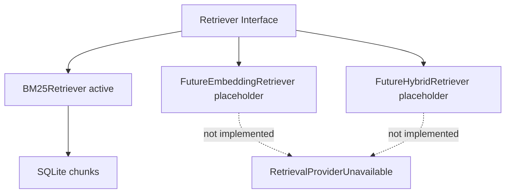
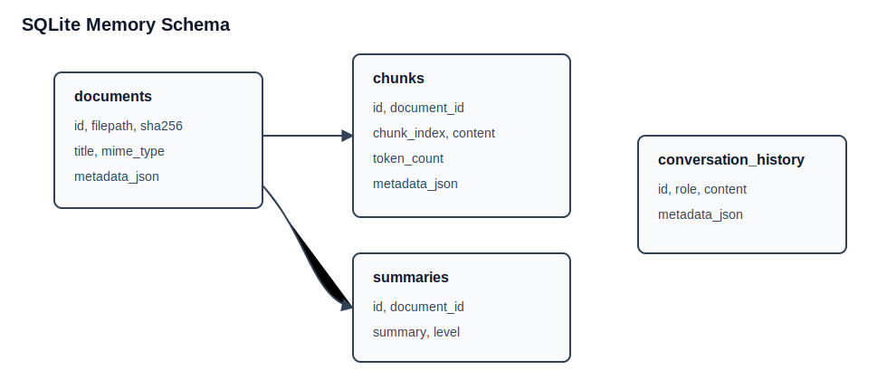
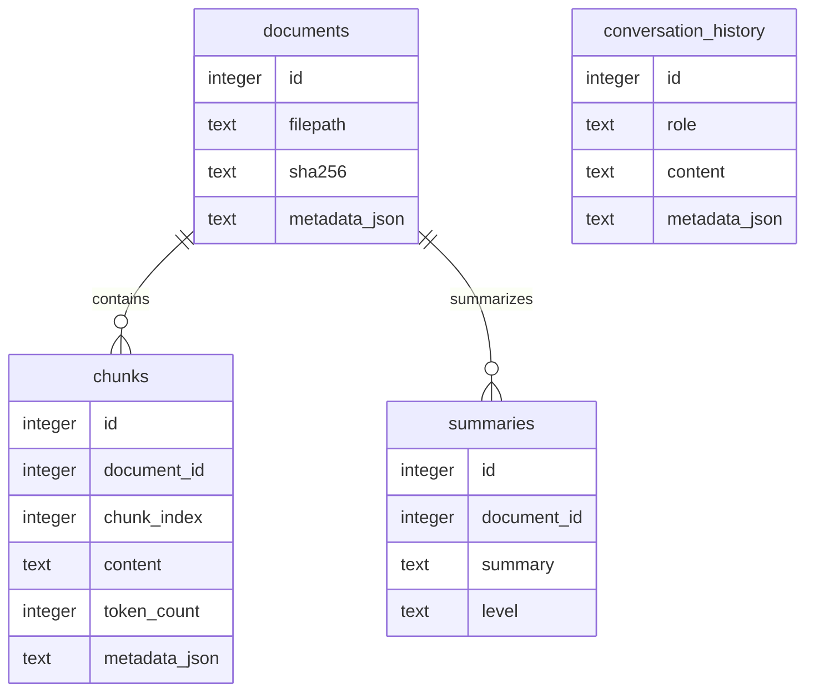

# Architecture Diagrams

This page contains Mermaid source diagrams and SVG exports for open-source documentation.

## System Pipeline

```mermaid
flowchart LR
    A["Local Files"] --> B["Reader Strategy"]
    B --> C["Parser / Chunker"]
    C --> D["Indexer"]
    D --> E["Rule-Based Compression"]
    E --> F["SQLite Memory Repository"]
    Q["User Question"] --> R["Retrieval Provider"]
    R --> T["Token Budget Selector"]
    T --> P["Context Builder"]
    P --> AI["AI Adapter"]
    AI --> O["Answer + Sources"]
    F --> R
```

## Retrieval Providers

```mermaid
flowchart TB
    I["Retriever Interface"] --> B["BM25Retriever active"]
    I --> E["FutureEmbeddingRetriever placeholder"]
    I --> H["FutureHybridRetriever placeholder"]
    B --> M["SQLite chunks"]
    E -. "not implemented" .-> X["RetrievalProviderUnavailable"]
    H -. "not implemented" .-> X
```

## Local Data Model

```mermaid
erDiagram
    documents ||--o{ chunks : contains
    documents ||--o{ summaries : summarizes
    conversation_history {
        integer id
        text role
        text content
        text metadata_json
    }
    documents {
        integer id
        text filepath
        text sha256
        text metadata_json
    }
    chunks {
        integer id
        integer document_id
        integer chunk_index
        text content
        integer token_count
        text metadata_json
    }
    summaries {
        integer id
        integer document_id
        text summary
        text level
    }
```
