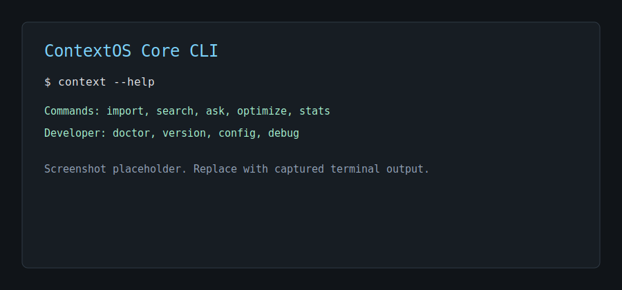
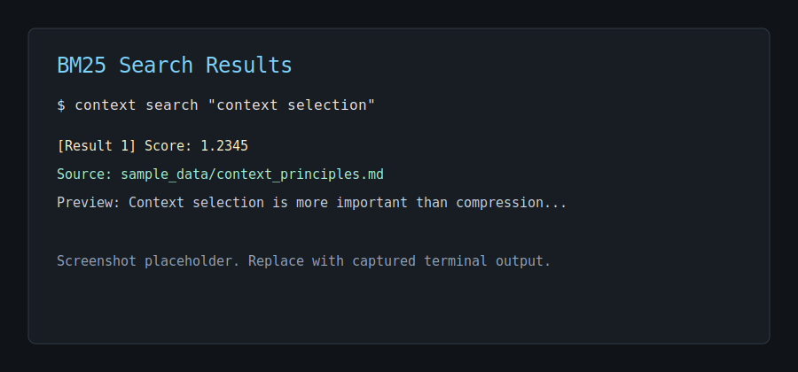
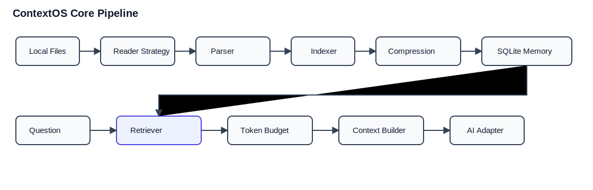

# ContextOS Core

[](https://www.python.org/)
[](https://typer.tiangolo.com/)
[](https://www.sqlite.org/)
[](https://github.com/dorianbrown/rank_bm25)
[](LICENSE)

ContextOS Core is a local-first CLI-based AI Context Management System.

```text
Context Selection is more important than Compression.
```

ContextOS Core is not a web app, cloud service, vector database, or hosted multi-user platform. It is a Python CLI that imports local files, chunks them, stores them in SQLite, retrieves relevant context with BM25, and builds prompts for local dry-run or adapter-based workflows.

Current release: **v1.1.0** with Token Savings Report and a desktop app MVP.

## Screenshots

CLI help placeholder:



Search results placeholder:



## Highlights

- Local-first Typer CLI
- Desktop app MVP under `apps/desktop`
- SQLite repository layer
- File readers for text, Markdown, code, PDF, and DOCX
- Parser and chunking pipeline
- Incremental import with SHA-256 checks
- BM25 lexical retrieval as the only active retriever
- v2 retrieval provider interface with future placeholders
- Rule-based light, medium, and aggressive compression
- Token budget selection
- Token Savings Report for ask flows
- Context builder
- Mock adapter for tests and dry local workflows
- Developer commands: `doctor`, `version`, `config`, `debug`

## Install

```powershell
git clone https://github.com/ZENCalbee-010/ContextOS-Core.git
cd ContextOS-Core
python -m venv .venv
.\.venv\Scripts\Activate.ps1
python -m pip install --upgrade pip
python -m pip install -e ".[dev]"
```

On Windows PowerShell, if `context` conflicts with another command, use:

```powershell
python -m contextos.cli.main --help
```

## Quick Demo

```powershell
$db = ".\data\demo.sqlite3"
context import .\sample_data --db-path $db
context search "context selection" --top-k 3 --db-path $db
context ask "Why is context selection important?" --dry-run --adapter mock --db-path $db
context optimize .\sample_data\context_principles.md --level medium --db-path $db
context stats --db-path $db
```

The demo stays local and does not call a real AI provider because it uses `--dry-run`.

`context ask` prints a Token Savings Report:

```text
TOKEN SAVINGS REPORT
Total available tokens: 12500
Selected context tokens: 1850
Saved tokens: 10650
Savings percent: 85.20%
```

## CLI Commands

```powershell
context --help
context import .\docs --db-path .\data\contextos.sqlite3
context search "context selection" --top-k 5 --db-path .\data\contextos.sqlite3
context ask "What matters most?" --dry-run --adapter mock --db-path .\data\contextos.sqlite3
context optimize .\docs\architecture.md --level aggressive --db-path .\data\contextos.sqlite3
context stats --db-path .\data\contextos.sqlite3
context benchmark --dataset .\sample_data\benchmark --db-path .\data\benchmark.db --output .\benchmark_report.md
context doctor
context version
context config
context debug
```

## Desktop App MVP

The desktop app is a Tauri + React + TypeScript wrapper around the existing Python CLI. It uses the same local-first core and the desktop database path `data/desktop.db`.

```powershell
cd apps\desktop
npm install
npm run dev
npm run tauri dev
```

The desktop bridge only allows approved local commands:

- `import`
- `search`
- `ask --dry-run`
- `ask --adapter mock`
- `optimize`
- `stats`

More details:

- [docs/DESKTOP_APP.md](docs/DESKTOP_APP.md)
- [apps/desktop/README.md](apps/desktop/README.md)

## Architecture



Core indexing flow:

```text
Reader -> Parser -> Indexer -> Compression -> Memory
```

Core question flow:

```text
Question -> Retrieval Provider -> Token Budget Selector -> Context Builder -> AI Adapter -> Response
```

More architecture documentation:

- [ContextOS_Architecture.md](ContextOS_Architecture.md)
- [ARCHITECTURE_DIAGRAM.md](ARCHITECTURE_DIAGRAM.md)
- [PROJECT_STRUCTURE.md](PROJECT_STRUCTURE.md)
- [docs/DESKTOP_APP.md](docs/DESKTOP_APP.md)
- [docs/RETRIEVAL_V2.md](docs/RETRIEVAL_V2.md)
- [docs/PERFORMANCE.md](docs/PERFORMANCE.md)
- [docs/BENCHMARK.md](docs/BENCHMARK.md)

## Scope

Included:

- CLI-first workflow using Typer
- SQLite local database
- BM25 lexical retrieval
- Optional retrieval provider architecture with BM25 active only
- Rule-based compression
- Local single-user workflows
- Mock adapter for tests and dry-runs
- Desktop GUI wrapper for local CLI workflows

Not included:

- FastAPI
- PostgreSQL
- Docker runtime dependency
- Vector database
- Embeddings
- Live hybrid retrieval
- Multi-user cloud system

## Development

Run tests:

```powershell
python -m pytest
python -m compileall contextos
```

Run CLI locally:

```powershell
python -m contextos.cli.main --help
```

## Open Source

- [CONTRIBUTING.md](CONTRIBUTING.md)
- [SECURITY.md](SECURITY.md)
- [CODE_OF_CONDUCT.md](CODE_OF_CONDUCT.md)
- [ROADMAP.md](ROADMAP.md)
- [ROADMAP_v2.md](ROADMAP_v2.md)
- [LICENSE](LICENSE)

## Current Limitations

- Claude and OpenAI adapters are not live API clients yet.
- BM25 is the only active retrieval provider.
- Embedding and hybrid retrievers are placeholders only.
- Compression is rule-based only.
- SQLite migrations are not implemented yet.
- The system is single-user and local-first by design.
- Desktop native drag/drop is not fully wired yet; the current MVP imports from a path field.
